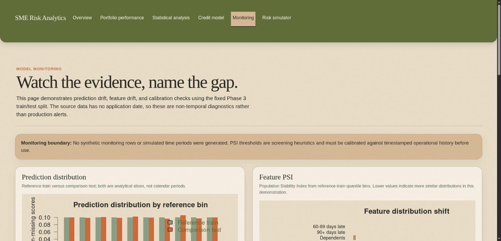
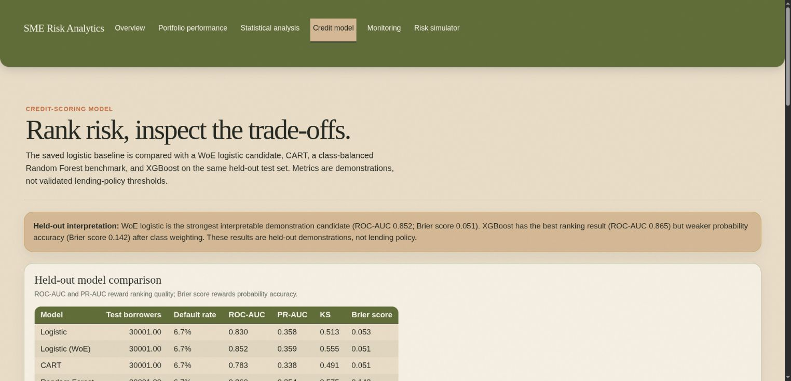

# Credit-SME Risk Analytics and Monitoring Dashboard

An R and Shiny project for exploring credit-risk patterns, comparing default-risk models, and presenting portfolio-monitoring insights through an interactive dashboard.

## Project status

The repository is initialized, `renv` is configured, and the reproducible data-cleaning, statistical-analysis, modeling, monitoring, and Shiny dashboard slices are available. The project validates the Kaggle training file, writes a cleaned CSV and SQLite database locally, generates analysis, model-evaluation, and monitoring reports, and serves an interactive dashboard from `app.R`. See the [task plan](docs/task-plan.md) for the development sequence and acceptance criteria.

## Dataset

This project uses the [Give Me Some Credit dataset on Kaggle](https://www.kaggle.com/datasets/lihxlhx/give-me-some-credit), based on the original [Give Me Some Credit competition](https://www.kaggle.com/c/GiveMeSomeCredit/data).

The dataset contains borrower-level credit information and the target `SeriousDlqin2yrs`, which indicates serious financial distress within two years. It does not contain a complete SME application funnel, application dates, processing stages, industry, geography, or loan amount fields.

The downloaded files are stored in `data/raw/` and intentionally ignored by Git. Do not commit confidential, restricted, or personally identifiable financial data.

## Available capabilities

- Data-quality profiling and exploratory analysis
- SQLite-backed KPI and portfolio queries
- Interpretable logistic-regression credit-risk model
- CART, Random Forest, and XGBoost comparison models
- ROC-AUC, PR-AUC, KS, lift, calibration, and threshold analysis
- Non-temporal demonstration monitoring for prediction drift, feature drift, PSI, and calibration
- Shiny pages for management overview, portfolio performance, statistical analysis, and model evaluation
- Shiny monitoring page with explicit train/test and production-data boundaries
- Applicant risk simulator for demonstration purposes

## Planned capabilities

- A defensible application-funnel dataset or explicitly labelled synthetic funnel page

## Planned repository structure

```text
.
├── app.R
├── R/
├── data/
│   ├── raw/
│   └── processed/
├── sql/
├── models/
├── reports/
├── screenshots/
├── docs/
└── renv.lock
```

## Getting started

### Prerequisites

- R and RStudio or another R environment
- Internet access for installing R packages and obtaining the dataset
- Optional: Kaggle account and API credentials for reproducible CLI downloads

### Clone the repository

```bash
git clone https://github.com/mohaakash/Credit-SME-Risk-Analytics-and-Monitoring-Dashboard.git
cd Credit-SME-Risk-Analytics-and-Monitoring-Dashboard
```

### Restore the dataset

The local raw files are not part of the Git repository. Download them from Kaggle and place the extracted files in `data/raw/`:

```bash
kaggle datasets download -d lihxlhx/give-me-some-credit \
  -p data/raw --unzip
```

Use [docs/task-plan.md](docs/task-plan.md) as the source of truth for the implementation sequence and remaining work.

### Restore the R environment and run the first pipeline

The project uses `renv` to record package versions. From the repository root:

```bash
Rscript -e 'install.packages("renv", repos = "https://cloud.r-project.org")'
Rscript -e 'renv::restore(prompt = FALSE)'
Rscript R/data_cleaning.R
Rscript R/statistical_analysis.R
Rscript R/train_models.R
Rscript R/model_monitoring.R
```

The pipeline expects the raw files in `data/raw/` and produces ignored local artifacts under `data/processed/`, `models/`, and `reports/generated/`. The tracked summaries are [reports/data-quality-report.md](reports/data-quality-report.md), [reports/statistical-analysis-report.md](reports/statistical-analysis-report.md), [reports/modeling-report.md](reports/modeling-report.md), and [reports/model-monitoring-report.md](reports/model-monitoring-report.md). Initial KPI queries are in [sql/kpi_queries.sql](sql/kpi_queries.sql).

### Run the dashboard

After the preparation commands complete, start the Shiny app from the repository root:

```bash
Rscript -e 'shiny::runApp(".", launch.browser = TRUE)'
```

The dashboard reads the cleaned SQLite data and saved model/evaluation/monitoring artifacts. It includes portfolio filters, segment performance, statistical summaries, held-out model evaluation, a non-temporal monitoring demonstration, and an applicant risk simulator using the saved preprocessing path.

## Dashboard captures





## Business findings

- The cleaned training file contains 150,000 rows and an observed serious-delinquency rate of 6.68%. The target is materially imbalanced, so ranking, calibration, and segment stability matter more than unvalidated accuracy claims.
- The WoE logistic candidate is the strongest interpretable demonstration model on the held-out split: ROC-AUC 0.8521 and Brier score 0.0513. XGBoost has the highest ranking score at ROC-AUC 0.8645, but its Brier score is 0.1423 after class weighting and requires calibration before any operational use.
- Historical delinquency and utilization are the strongest screening signals in this sample. The 90+ day delinquency group with 3+ events has a 61.68% observed default rate, while the utilization band from 1.00 to 2.00 has a 40.10% rate. These are associations requiring validation, not automatic decisions.
- The monitoring demonstration shows prediction PSI of 0.0006 and feature PSI below 0.001 when comparing the fixed train/test slices. Because the dataset has no dates, this does not prove production stability or absence of future drift.

## Credit-policy recommendations

These recommendations are analytical next steps for validation, not approved banking policy:

1. Use the WoE logistic model as the primary interpretable candidate for challenger review, with independent validation, calibration, documented overrides, and outcome monitoring before any live use.
2. Treat recent delinquency and unusually high revolving utilization as candidate triggers for additional verification or manual review. Do not convert the observed rates into automatic decline rules without cost, capacity, and fairness analysis.
3. Require probability calibration and governance review before using Random Forest or XGBoost scores for decisions. Their ranking performance does not make their raw probabilities decision-ready.
4. Establish timestamped production monitoring for score distributions, feature missingness, PSI, calibration, realized default rates, and segment performance. The current report is only a non-temporal demonstration.
5. Re-test performance across age and income-availability segments and investigate disparate error rates before using any threshold. Age is present in the data, while protected-class attributes and SME context are not.

## Limitations and responsible use

This is an educational portfolio-risk demonstration using a public historical dataset. It is not a lending model, underwriting policy, compliance assessment, or fairness certification. The source does not contain application dates, loan amounts, industries, geography, processing stages, or a complete SME application context. The stratified train/test split is not a time-based validation split.

The cleaning pipeline treats known sentinel values as missing, retains missingness indicators, and documents extreme-value flags. The target remains imbalanced, and several high Information Value signals require leakage and temporal-availability review. The dataset does not provide protected-class labels, so the fairness proxy checks are incomplete and cannot establish fair lending performance. Age, income availability, and other variables may still act as proxies or reflect data-collection differences.

Do not use the dashboard simulator, risk bands, thresholds, PSI heuristics, or segment rates to make or support a real credit decision. Any future synthetic application-funnel data must be stored separately and explicitly labelled as synthetic.
