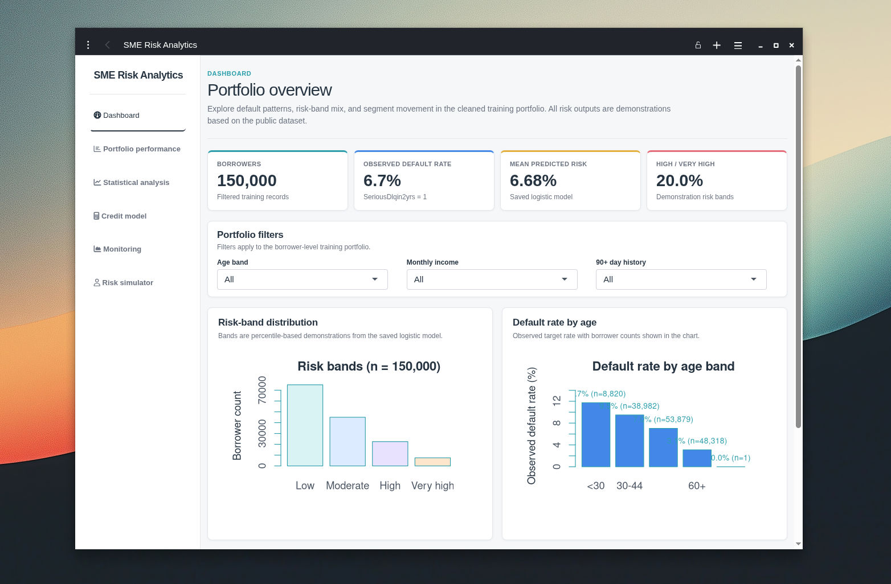
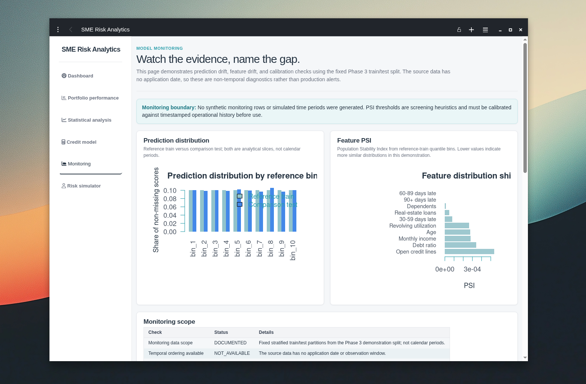
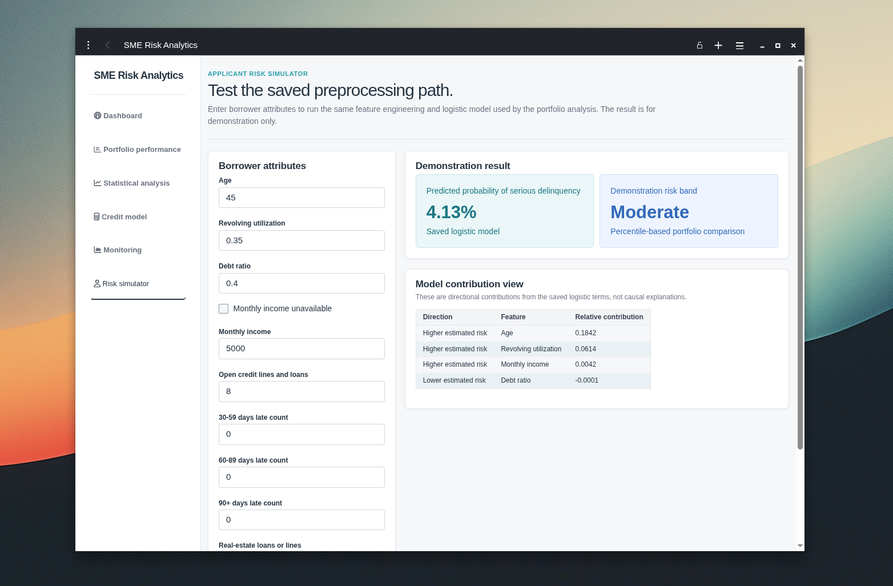
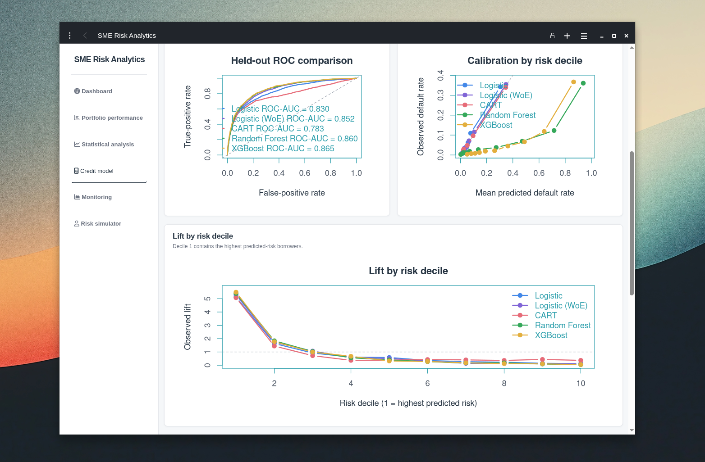

# Credit-SME Risk Analytics and Monitoring Dashboard

An R and Shiny project for exploring credit-risk patterns, comparing default-risk models, and presenting portfolio-monitoring insights through an interactive dashboard.

## Dashboard preview



## Project status

The repository is initialized, `renv` is configured, and the reproducible data-cleaning, statistical-analysis, modeling, monitoring, and Shiny dashboard slices are available. The project validates the Kaggle training file, writes a cleaned CSV and SQLite database locally, generates analysis, model-evaluation, and monitoring reports, and serves an interactive dashboard from `app.R`. See the [task plan](docs/task-plan.md) for the development sequence and acceptance criteria.

## Dataset

This project uses the [Give Me Some Credit dataset on Kaggle](https://www.kaggle.com/datasets/lihxlhx/give-me-some-credit), based on the original [Give Me Some Credit competition](https://www.kaggle.com/c/GiveMeSomeCredit/data).

The dataset contains borrower-level credit information and the target `SeriousDlqin2yrs`, which indicates serious financial distress within two years. It does not contain a complete SME application funnel, application dates, processing stages, industry, geography, or loan amount fields.

The downloaded files are stored in `data/raw/` and intentionally ignored by Git. Do not commit confidential, restricted, or personally identifiable financial data.

## Business case study

### Business context

A credit institution needs a repeatable way to understand borrower risk, compare candidate scoring approaches, and monitor whether a model's inputs and outputs remain stable. The goal is not to automate lending decisions immediately; it is to create an evidence-based analysis layer that helps risk, portfolio, and data teams decide what requires further validation.

### Business questions

This project addresses four practical questions:

1. Which borrower attributes are associated with serious delinquency within two years?
2. Which candidate model provides the best balance of ranking quality, probability accuracy, and interpretability?
3. Which borrower segments show materially different observed default rates or model performance?
4. What would a responsible monitoring workflow need to check before operational deployment?

### Analytical solution

The solution imports and validates the public Give Me Some Credit data, stores the cleaned records in SQLite, builds a leakage-safe modeling dataset, compares interpretable and tree-based models, and presents the results through a Shiny dashboard. It also includes a non-temporal monitoring demonstration because the source contains no application or scoring dates.

### Business outcome

The current evidence supports using the WoE logistic model as an interpretable candidate for further challenger review. XGBoost provides the strongest ranking result, but its raw probabilities require calibration and governance before operational use. Delinquency history and revolving utilization are useful candidate signals for additional verification or manual-review analysis, not automatic approval or decline rules.

The main business deliverable is therefore a reproducible decision-support prototype: it makes risk patterns, model trade-offs, monitoring gaps, and responsible-use boundaries visible in one place.

## Available capabilities

- Data-quality profiling and exploratory analysis
- SQLite-backed KPI and portfolio queries
- Interpretable logistic-regression credit-risk model
- CART, Random Forest, and XGBoost comparison models
- ROC-AUC, PR-AUC, KS, lift, calibration, and threshold analysis
- Non-temporal demonstration monitoring for prediction drift, feature drift, PSI, and calibration
- Shiny pages for management overview, portfolio performance, statistical analysis, and model evaluation
- Shiny monitoring page with explicit train/test and production-data boundaries
- Applicant risk simulator for demonstration purposes

## Planned capabilities

- A defensible application-funnel dataset or explicitly labelled synthetic funnel page

## Technical explanation

### Data preparation

`R/data_cleaning.R` reads the Kaggle training file, standardizes column names, validates the target and identifiers, converts known `96`/`98` delinquency sentinels to missing values, flags invalid ages and extreme values, writes a cleaned CSV, and loads the data into SQLite. The cleaning report records row counts, missingness, quality flags, and target balance.

### Statistical analysis

`R/statistical_analysis.R` produces missingness summaries, distributions, group comparisons, confidence intervals, chi-square tests, Spearman correlations, and an initial logistic interpretation. These results are descriptive associations and are not treated as causal evidence.

### Feature engineering and modeling

`R/feature_engineering.R` creates log-transformed ratios and income fields, missingness indicators, and quality flags. `R/train_models.R` uses a fixed stratified split with seed `20260921`; preprocessing is fitted on the training partition only. The candidate models are:

- Raw-feature logistic regression baseline
- Training-only Weight of Evidence logistic regression
- CART benchmark
- Class-balanced Random Forest benchmark
- Fixed-parameter XGBoost benchmark

Models are evaluated on the same held-out test set using ROC-AUC, PR-AUC, KS, lift, Brier score, calibration, threshold trade-offs, segment stability, leakage checks, and fairness proxy diagnostics.

### Monitoring

`R/model_monitoring.R` scores the fixed train/test partitions with the saved logistic baseline and writes prediction distributions, feature drift summaries, PSI bin contributions, and calibration tables. Because the source has no date field, the outputs are explicitly labelled `non_temporal_demonstration`; they are not production alerts or evidence of future stability.

### Dashboard

`app.R` loads the SQLite data and saved artifacts into a Shiny application with pages for portfolio overview, segment performance, statistical analysis, held-out model comparison, monitoring diagnostics, and an applicant-risk simulator. The simulator uses the same saved preprocessing path as the baseline model and is labelled demonstration-only.

### Reproducibility

The project uses `renv` for package management, fixed seeds for the modeling split, tracked scripts and reports, documented dataset provenance, and startup checks that fail clearly when required artifacts are missing.

## Repository structure

```text
.
├── app.R                              # Shiny dashboard
├── R/
│   ├── data_cleaning.R                 # Import, validation, cleaning, SQLite load
│   ├── feature_engineering.R           # Shared model features and WoE functions
│   ├── statistical_analysis.R          # Descriptive and inferential analysis
│   ├── train_models.R                  # Model training and evaluation
│   └── model_monitoring.R              # PSI, drift, and calibration diagnostics
├── data/
│   ├── raw/                            # Local Kaggle files; ignored by Git
│   └── processed/                      # Cleaned CSV and SQLite database; ignored
├── sql/
│   └── kpi_queries.sql                 # Reusable SQLite KPI queries
├── models/                             # Saved local model objects; ignored
├── reports/
│   ├── generated/                      # Reproducible CSV/PNG outputs; ignored
│   ├── data-quality-report.md
│   ├── statistical-analysis-report.md
│   ├── modeling-report.md
│   └── model-monitoring-report.md
├── screenshots/                        # Dashboard presentation captures
├── docs/
│   ├── data-dictionary.md
│   ├── credit-sme-risk-analytics-shiny.md
│   └── task-plan.md
├── renv.lock                           # Reproducible R package lockfile
└── README.md
```

## How to run the project

### Prerequisites

- R and RStudio or another R environment
- Internet access for installing R packages and obtaining the dataset
- Optional: Kaggle account and API credentials for reproducible CLI downloads

### Clone the repository

```bash
git clone https://github.com/mohaakash/Credit-SME-Risk-Analytics-and-Monitoring-Dashboard.git
cd Credit-SME-Risk-Analytics-and-Monitoring-Dashboard
```

All commands below must be run from the repository root.

### Restore the dataset

The local raw files are not part of the Git repository. Download them from Kaggle and place the extracted files in `data/raw/`:

```bash
kaggle datasets download -d lihxlhx/give-me-some-credit \
  -p data/raw --unzip
```

Use [docs/task-plan.md](docs/task-plan.md) as the source of truth for the implementation sequence and remaining work.

### Restore the R environment and run the complete pipeline

The project uses `renv` to record package versions. From the repository root:

```bash
Rscript -e 'install.packages("renv", repos = "https://cloud.r-project.org")'
Rscript -e 'renv::restore(prompt = FALSE)'
Rscript R/data_cleaning.R
Rscript R/statistical_analysis.R
Rscript R/train_models.R
Rscript R/model_monitoring.R
```

The pipeline expects the raw files in `data/raw/` and produces ignored local artifacts under `data/processed/`, `models/`, and `reports/generated/`. The tracked summaries are [reports/data-quality-report.md](reports/data-quality-report.md), [reports/statistical-analysis-report.md](reports/statistical-analysis-report.md), [reports/modeling-report.md](reports/modeling-report.md), and [reports/model-monitoring-report.md](reports/model-monitoring-report.md). Initial KPI queries are in [sql/kpi_queries.sql](sql/kpi_queries.sql).

To verify the environment after restoration:

```bash
Rscript -e 'renv::status()'
```

The expected result is `No issues found -- the project is in a consistent state.`

### Run the dashboard

After the preparation commands complete, start the Shiny app from the repository root:

```bash
Rscript -e 'shiny::runApp(".", launch.browser = TRUE)'
```

The dashboard reads the cleaned SQLite data and saved model/evaluation/monitoring artifacts. It includes portfolio filters, segment performance, statistical summaries, held-out model evaluation, a non-temporal monitoring demonstration, and an applicant risk simulator using the saved preprocessing path.

If the browser does not open automatically, start the app without launching a browser:

```bash
Rscript -e 'shiny::runApp(".", launch.browser = FALSE)'
```

Then open the local URL printed by Shiny. Stop the application with `Ctrl+C`.

### Re-run only the dashboard

If the cleaned data, model artifacts, and monitoring outputs already exist, run only:

```bash
Rscript -e 'shiny::runApp(".", launch.browser = TRUE)'
```

If startup reports missing artifacts, rerun the complete pipeline in the order shown above.

## Additional dashboard captures

### Model monitoring



### Risk simulator



### Credit model evaluation



## Business findings

- The cleaned training file contains 150,000 rows and an observed serious-delinquency rate of 6.68%. The target is materially imbalanced, so ranking, calibration, and segment stability matter more than unvalidated accuracy claims.
- The WoE logistic candidate is the strongest interpretable demonstration model on the held-out split: ROC-AUC 0.8521 and Brier score 0.0513. XGBoost has the highest ranking score at ROC-AUC 0.8645, but its Brier score is 0.1423 after class weighting and requires calibration before any operational use.
- Historical delinquency and utilization are the strongest screening signals in this sample. The 90+ day delinquency group with 3+ events has a 61.68% observed default rate, while the utilization band from 1.00 to 2.00 has a 40.10% rate. These are associations requiring validation, not automatic decisions.
- The monitoring demonstration shows prediction PSI of 0.0006 and feature PSI below 0.001 when comparing the fixed train/test slices. Because the dataset has no dates, this does not prove production stability or absence of future drift.

## Credit-policy recommendations

These recommendations are analytical next steps for validation, not approved banking policy:

1. Use the WoE logistic model as the primary interpretable candidate for challenger review, with independent validation, calibration, documented overrides, and outcome monitoring before any live use.
2. Treat recent delinquency and unusually high revolving utilization as candidate triggers for additional verification or manual review. Do not convert the observed rates into automatic decline rules without cost, capacity, and fairness analysis.
3. Require probability calibration and governance review before using Random Forest or XGBoost scores for decisions. Their ranking performance does not make their raw probabilities decision-ready.
4. Establish timestamped production monitoring for score distributions, feature missingness, PSI, calibration, realized default rates, and segment performance. The current report is only a non-temporal demonstration.
5. Re-test performance across age and income-availability segments and investigate disparate error rates before using any threshold. Age is present in the data, while protected-class attributes and SME context are not.

## Limitations and responsible use

This is an educational portfolio-risk demonstration using a public historical dataset. It is not a lending model, underwriting policy, compliance assessment, or fairness certification. The source does not contain application dates, loan amounts, industries, geography, processing stages, or a complete SME application context. The stratified train/test split is not a time-based validation split.

The cleaning pipeline treats known sentinel values as missing, retains missingness indicators, and documents extreme-value flags. The target remains imbalanced, and several high Information Value signals require leakage and temporal-availability review. The dataset does not provide protected-class labels, so the fairness proxy checks are incomplete and cannot establish fair lending performance. Age, income availability, and other variables may still act as proxies or reflect data-collection differences.

Do not use the dashboard simulator, risk bands, thresholds, PSI heuristics, or segment rates to make or support a real credit decision. Any future synthetic application-funnel data must be stored separately and explicitly labelled as synthetic.
